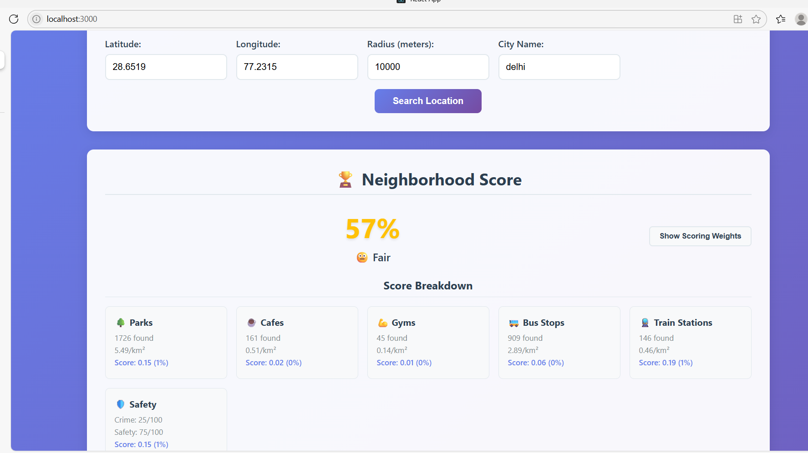
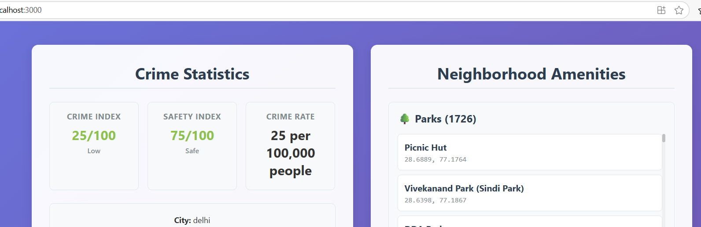

# NeighborhoodFit - Lifestyle Based Neighborhood Matching App 🏡✨
A full-stack web app that helps users match their lifestyle preferences (like access to parks, cafes, safety, transport, etc.) with the best-suited neighborhood using real-time data and a scoring algorithm.

🚀 Built with React (frontend) + Node.js/Express (backend) + Overpass API & CrimeScore API.

## 🧠 Problem Definition
# How can we help users choose a neighborhood that fits their lifestyle (quiet, social, accessible, safe) using real data?

## ✨ Features
- 🔍 Search neighborhoods by location (lat/lon/city)
- 🏆 Calculates a "Neighborhood Score" out of 100
- 🌳 Analyzes Parks, Cafes, Gyms, Transport access
- 🛡️ Crime and Safety Index shown
- 📊 Breakdown of all scores and densities
- ⚙️ Fully integrated backend APIs (Overpass + mock crime API fallback)

## 🧪 Hypothesis & Assumptions
People who prefer peace → seek more parks and fewer social spots
Social users prefer cafes/gyms
Others need transport accessibility
Everyone values safety
→ So we combine all 4 to make a smart matching score!

## 🔍 Research & Data Sources
🗺️ Overpass API (OpenStreetMap) → parks, cafes, gyms, transport
🔐 CrimeScore API → city-level safety data (mock fallback enabled)
Data processed in backend with score logic & filters

## 🧠 Matching Algorithm

The neighborhood's final score is computed using the following formula:

finalScore =
0.4 * safety +
0.2 * quietness +
0.2 * social +
0.2 * accessibility

### 📊 Breakdown of Each Factor:

| Factor         | How It's Calculated                                   |
|----------------|--------------------------------------------------------|
| 🛡️ Safety       | `100 - crimeIndex` (lower crime → higher score)       |
| 🏞️ Quietness    | `parks per km²` (more parks = quieter)                |
| 🤝 Social       | `cafes + gyms per km²` (more = socially active area)  |
| 🚉 Accessibility| `bus stops + train stations per km²`                  |

- All counts are fetched in real-time using **Overpass API** based on user-selected `latitude`, `longitude`, and `radius`.
- Crime Index is fetched from **CrimeScore API** or fallback via **City API / mock data**.
- Scores are normalized before applying weights.
- Output is rendered on frontend with category-wise breakdown and total score.

📌 *Note:* Weightage (`0.4`, `0.2`, etc.) is fixed for now but can be made dynamic based on user preferences in future versions.


## 🔧 Tech Stack
- **Frontend**: React.js
- **Backend**: Node.js + Express.js
- **APIs**:
  - OpenStreetMap Overpass API (real neighborhood data)
  - CrimeScore API (fallback to mock if needed)
- **Styling**: Tailwind CSS / Custom CSS


## 🚀 Getting Started (Local Setup)

### 1. Clone the Repo
```bash
git clone https://github.com/AnnuSangwan98/Neighborhood-Project.git

```
### 2. Install Backend Dependencies
```bash
cd backend
npm install
```
### 3. Run Backend
```bash
node index.js
# Server runs on http://localhost:8080
```
### 4. Install Frontend Dependencies
```bash
cd frontend
npm install
```
### 5. npm start
```bash
npm start
# Opens on http://localhost:3000
```

---

📍**Project Structure**
```md
## 📁 Project Structure
Neighborhood-Project/
├── backend/
│ └── index.js # Express server & APIs
├── frontend/
│ └── src/ # React components
├── README.md

```
## 🧠 Matching Algorithm
Neighborhood Score = Weighted sum of:
- Parks Density
- Cafes Density
- Gym Access
- Public Transport
- Crime & Safety Index

Weights are customizable and displayed in UI.

## 📸 Screenshots

### 🧮 Neighborhood Score Breakdown


### 🛡️ Crime & Safety Details


## 💡 Edge Case Handling
Missing lat/lon/city → graceful backend error
Timeout or API failure → shows fallback data
All inputs validated in backend

##  🧗 Challenges Faced
Overpass API query limits / response delays
Port conflict resolved (5432 vs 8080)
Crime API fallback required due to rate limits

## 🔭 Learnings & Future Scope
🔢 Allow custom user preferences for weights
🏫 Add school/hospital data
🔥 Visual crime heatmaps
☁️ Host on Vercel + Render for free

## 📌 Final Thoughts
This project:
✅ Combines real-time urban data
✅ Uses algorithmic reasoning to help users
✅ Handles real-world API, validation, and integration challenges
🔖 A perfect blend of data science, full-stack development, and systems thinking!


